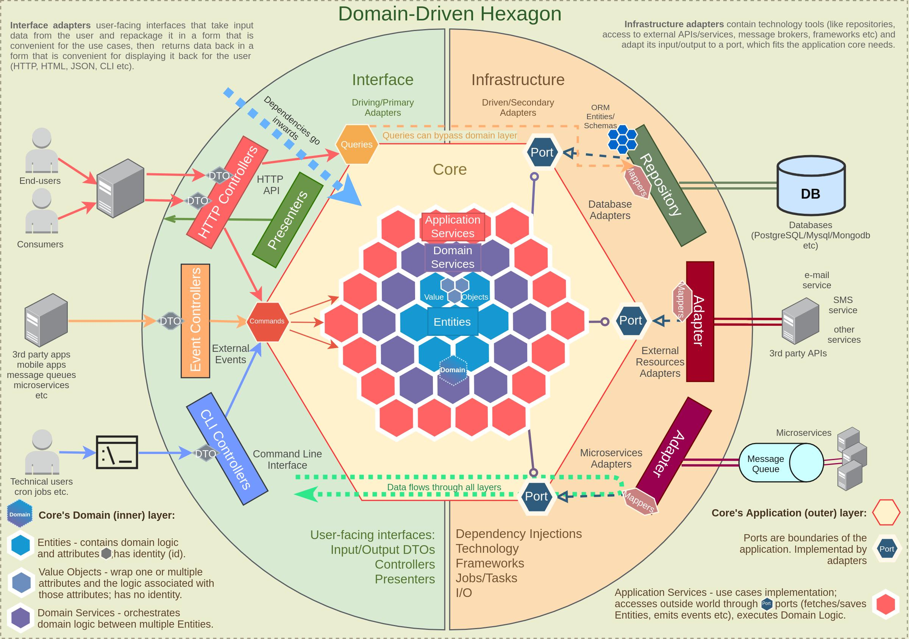

# API-Docker Template

ScaleMote's template for creating API projects.

## Installation
- Set your node version to at least 16.x
- Run `npm i` to install dependencies
- Run `npm run prepare` to install husky precommit hook.

## How to run
```
npm start
# Runs the app in local. The port is determined by the `PORT` enviroment variable. 

npm run start:dev
# Runs the app in watch mode. In this mode the app will restart after any change.
```

## Useful commands
```
npm run lint
# Execute eslint in all the project and solves any fixable problem.

npm run format
# It uses prettier to solves any formatting issue that it fixable.

npm run build
# Builds the app for production to the dist folder.
# The build is minified and optimized. This make the app ready to be deployed.
```

## Testing
```
npm run test
# Used for run all the jest tests

npm run test:cov
# It will run all the tests and also create a code coverage report in `./coverage`.
```

## Migrations
Migrations solve the common problem of having to manually update a local database schema when pulling in changes from source control.
```
npm run migrate:create
# Creates a new migration file in `./data/migrations`.

npm run migrate:generate
# Uses TypeORM to automatically generate migration files with schema changes you made.

npm run migrate:run
# This runs all migrations that was never run before, updating your database.

npm run migrate:revert
# This reverts all the changes made with migrations to your database.
```

## CI/CD
The application implements continuous integration and continuous delivery by integrating with github actions. Current actions include:
- Running eslint and prettier
- Building the app
- Running tests with code coverage report generation
- Reporting the code coverage of any new change.
- Running Sonarqube scan and quality gate check


## Motivation

Homogenisation of technology, structures & processes makes software engineering teams more effective; the trade-off is
not implementing other technologies, which is one we accept.

Even though from time to time we will need to adapt to previous code and existing ways of working, when given the
chance, greenfield projects must be created following this template.
When this template is not suitable for your needs, raise an issue and we will strive to improve it, instead of having
bespoke implementations for each project.
Having said that, each project tends to be unique and certain small & controlled deviations will be accepted.

## General architecture

This template follows a Clean Architecture style, specifically the Hexagonal architecture.



### Folder organisation

Within the `src` folder is where our application code lives,inside it, we will have a list of modules. A module is a
business-driven way of slicing a project.
You can either split a project by technical responsibility (controllers, repositories, services, entities) or you can do
it by it's business function (books, authors, publishers, etc.).
We choose the latter. All code pertaining a certain business concept should stay together.

| Folder         | Description                                                                                                                                                                                                                                                                                                                                                                     |
|----------------|---------------------------------------------------------------------------------------------------------------------------------------------------------------------------------------------------------------------------------------------------------------------------------------------------------------------------------------------------------------------------------|
| Interface      | The interface folder contains files related to interfacing with a client. Here we can add HTTP controllers or CLI controllers.                                                                                                                                                                                                                                                  |
| Application    | The application folder contains application logic, for instance DTOs that the Interface layers use, mappers to translate DTOs into entities or vice-versa, a repository folder where we will store the INTERFACE of this repository (the concrete implementation lives in the infrastructure layer) and a service or use-case folder where we connect infrastructure and domain |
| Domain         | The domain folder contains the enterprise rules, and it does not depend on any other layer. This layer can be TDD'd and unit tested independently of any other layer.                                                                                                                                                                                                           |
| Infrastructure | The infrastructure folder contains the access to the database, APIs and other 3rd party services or devices.                                                                                                                                                                                                                                                                    |

### General flow of information & layer interdependencies


Please note in this image, UI is the Interface layer.

The interface layer (the controller) can access the infrastructure directly. This is to avoid creating bloated code,
let's see an example:

```javascript
// A controller accessing a repository directly

function getAllUsers (page) {
  this.userService.getPaginatedResponseDto(this.repository.getAllUsers(page))
}
```

```javascript
// A controller accessing a repository through a service

function getAllUsers (page) {
  this.userService.getAllUsers(page);
}

// Service
function getAllUsers (page) {
  this.getPaginatedResponseDto(this.repository.getAllUsers(page))
}
```

If we have to create this structure for every controller method, our services will quickly become too big and they will
essentially replicate the same functionality that the controller should be able to provide from the get-go.

Service methods are useful when they actually contain some business logic.
